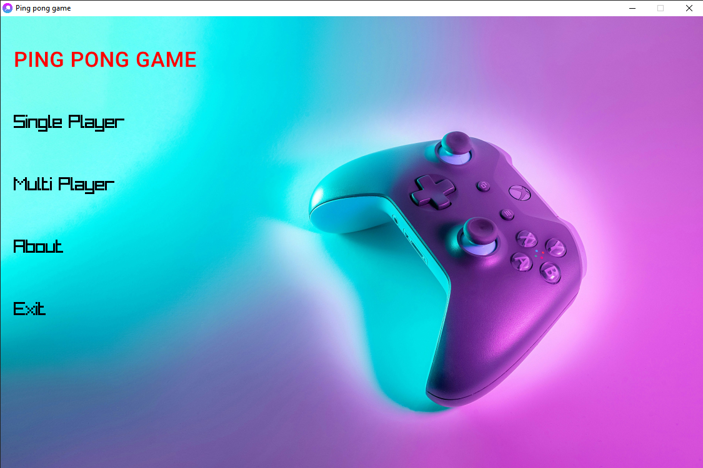
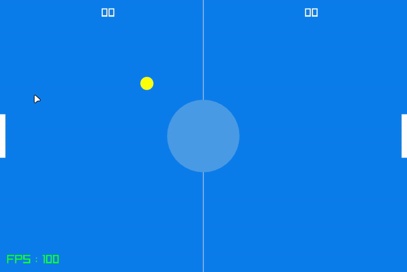

<div align="center">


# Ping Pong Game

[](https://github.com/Spike271/PING_PONG/actions/workflows/Build%20for%20all%20platforms.yml)

</div>

## About the Project

This is a simple Ping Pong game made in **C** using the **raylib** library. The game supports both single-player and
multiplayer modes. It is designed to provide a classic Pong experience with customizable gameplay elements, such as the
score needed to win the game.

## Screenshot





## Features

- **Single-Player Mode**: Play against an AI opponent.
	- Control the left paddle using `W` and `S` keys.
	- The first to reach the predefined score wins.
- **Multiplayer Mode**: Play locally with a friend.
	- Left player controls the left paddle (`W`/`S` keys).
	- Right player controls the right paddle (`Up`/`Down` arrow keys).
- **About Section**: Learn more about the game through the in-game "About" section.
- You can customize the winning score by modifying the `score.txt` file.(This file will be created after launching the executable. The changes will take affect after the game is restarted.)

## Technologies Used

- **Language**: C
- **Graphics Library**: raylib
- **GUI Library**: raygui

## How to Play

1. Launch the game.
2. Use the menu to select the desired mode:
	- Single Player
	- Multiplayer
	- About
	- Exit
3. Gameplay:
	- Single Player: Use `W` and `S` keys to control your paddle while competing against the AI.
	- Multiplayer: Both players manage their paddles to try and score 3 points to win (or the customized value set in
	  `score.txt`).
4. Exit sections or return to the main menu using the `ESC` key.

## Prerequisites

Before building or running this project, ensure you have the following dependencies installed:

- C98 compatible compiler

### For Desktop
- [CMake](https://cmake.org/documentation/) (3.30 or higher)
- [Ninja](https://ninja-build.org/) (if you're not building for Visual Studio)

##### For Linux

> Info: Make sure to check out the [raylib wiki](https://github.com/raysan5/raylib/wiki/Working-on-GNU-Linux) to make sure you have all necessary dependencies installed on your machine. 

## For Web
- [Emscripten](https://emscripten.org/docs/getting_started/downloads.html)
- [CMake](https://cmake.org/documentation/) (3.30 or higher)

## Building the Project (For Desktop)

### Clone the Repository

Start by cloning the project from the GitHub repository:

```bash
# Clone the Repository
git clone https://github.com/Spike271/Ping_Pong.git
```

### For Windows (Visual Studio)

1. Generate build files:
   ```bash
   cmake -B build
   ```

2. Build the project:
   ```bash
   cmake --build build -j8 --config Release
   ```

### For Other Platforms (Also works for Windows)

1. Create and navigate to the build directory:
   ```bash
   mkdir build
   cd build
   ```

2. Generate the build system files using Ninja:
   ```bash
   cmake -G "Ninja" -D CMAKE_C_COMPILER=gcc -D CMAKE_BUILD_TYPE=Release ..
   ```

3. Build the project:
   ```bash
   ninja
   ```

### Building for Web

1. Ensure you have [Emscripten](https://emscripten.org/docs/getting_started/downloads.html) installed and activated in
   your environment.


2. Create and navigate to the build-web directory:
   ```bash
   mkdir build-web
   cd build-web
   ```

3. Generate the build files using Emscripten:
   ```bash
   emcmake cmake .. -DPLATFORM=Web -DCMAKE_BUILD_TYPE=Release
   ```

4. Build the project:
   ```bash
   emmake make
   ```

5. The build will generate the following files:
	- `PING_PONG.html` - The HTML page to load the game
	- `PING_PONG.js` - JavaScript code
	- `PING_PONG.wasm` - WebAssembly binary
	- `PING_PONG.data` - Game resources

6. To run the game, you'll need to serve these files using a local web server:
   ```bash
   # Using Python 3
   python3 -m http.server 8080
   # Then open localhost:8080/PING_PONG.html in your browser

   # Alternatively, if you have the emscripten binaries in your path, you can run the following command
   emrun PING_PONG.html
   ```

## Acknowledgements

- [raylib](https://www.raylib.com/) - A simple and easy-to-use library for game development
- [raygui](https://github.com/raysan5/raygui) - A simple and easy-to-use immediate-mode GUI library
